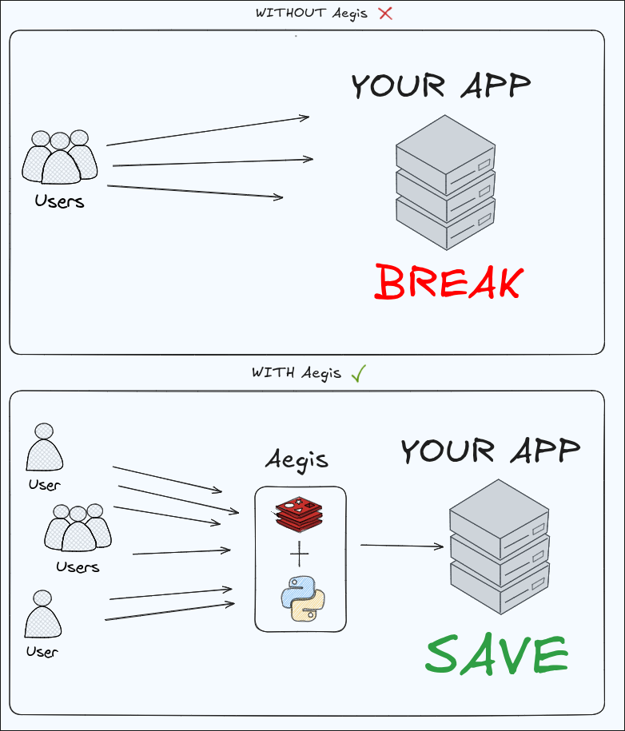

# Aegis 👑

## Usage

```bash
git clone https://github.com/doaks1638-netizen/Aegis.git && cd Aegis
mv .env.example .env && vim .env
vim aegis.toml
sudo docker compose up --build
```

## Warning

- Aegis uses ports 6379 and 6378 to operate. If you need to change these, specify them in docker-compose. You may also have problems deploying to a local network due to Docker, use your local network address

## Architecture



## Config

```toml
[settings]
address = "127.0.0.1:8000" # address where requests are forwarded
rm = '5/m' # default rate limiter (for server and all_path)
rrm = '1/m'
queue=false # True - queued and sent code; False - client will wait; False by default
all_path = true # for routes not listed in the config, use the server settings
behind_nginx = false # This is needed to correctly extract the IP from the request. If true, you need to uncomment nginx in docker-compose.yaml for it to work correctly.
max_wait_time = 62.5 # Measured in seconds. If the wait time is more than max_wait_time seconds, the request is immediately sent with code 429 and a clear message. Please note that we do not wait max_wait_time seconds, but it is calculated using the formula thanks to the fixed RPS
max_failures = 5 # How many consecutive errors does it take to block on cb_cooldown sec
sec_cooldown = 30.5 # Number of seconds for the block. If `max_failures` is specified but `sec_cooldown` is not specified, the default is 5

[[route]] # use this directive to define a route
path = "/api/v1/products"
rm = "5/m" # how many requests will be accepted
rrm = "1/m" # how many requests will actually reach the server
queue=false
code=202 # also default code for queue
active = true
max_wait_time = 16.05

[[route]]
path = "/api/v1/users"
rm = "10/m"
rrm = '1/m' # if omitted entirely, all requests bypass rrm immediately
active = false # whether to serve this API?
max_failures = 5
sec_cooldown = 30.5
```

## Deployment with NGINX

Aegis buffers request payloads in memory before processing/queuing them. To protect Aegis from memory exhaustion when clients upload large files, it is recommended to run NGINX in front of Aegis and restrict payload sizes using `client_max_body_size`.

### Option 1: Using your own NGINX / Reverse Proxy ⚡

If you are using your own NGINX or external reverse proxy:

1. Enable `behind_nginx = true` in `aegis.toml` so Aegis extracts the client IP from HTTP headers:
   ```toml
   [settings]
   behind_nginx = true
   ```
2. In your NGINX configuration, pass the `X-Real-IP` header and limit max body size:
   ```nginx
   client_max_body_size 10m;
   proxy_set_header X-Real-IP $remote_addr;
   ```

### Option 2: Using the built-in NGINX container 📦

An optional pre-configured NGINX setup is included in the project:

1. Set `behind_nginx = true` in `aegis.toml`.
2. Uncomment the `nginx` service in `docker-compose.yaml`.
3. Adjust `client_max_body_size` in `nginx/nginx.conf` if needed (default: `10m`).

## Roadmap


